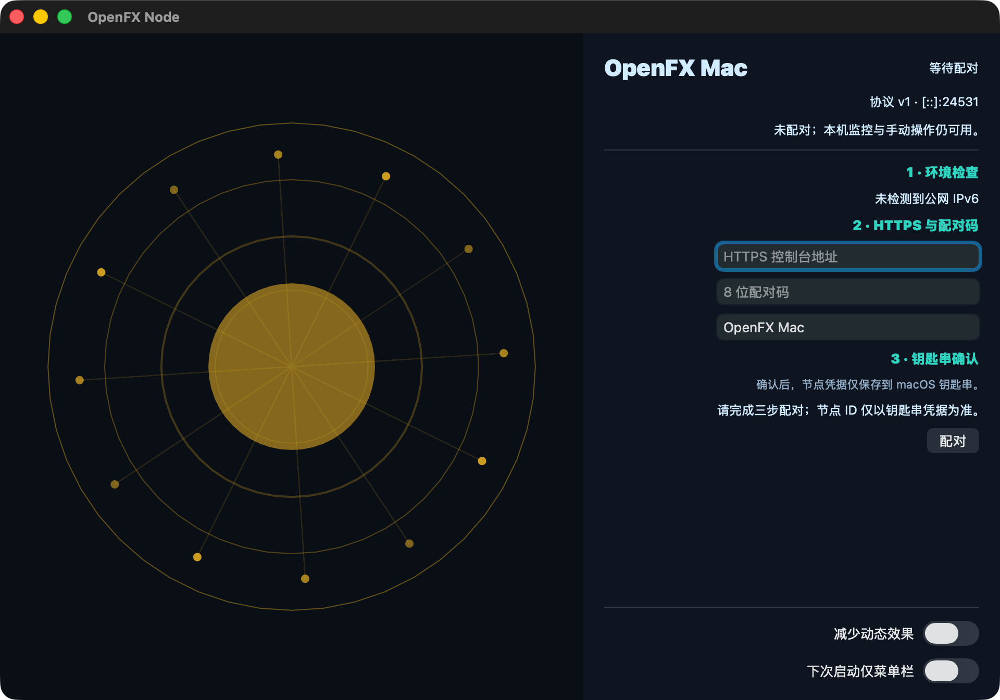

# Task 3 report: immersive Perry main window, Dock, and Tray

Date: 2026-07-19

Status: COMPLETE

## Outcome

OpenFX Node now has one native Perry main window with a 960 x 640 default size,
880 x 580 minimum size, AppKit vibrancy, a live Freemac Core Canvas on the left,
and a pairing/workbench control panel on the right. The app defaults to the regular
Dock mode, honors a synchronously loaded `menuBarOnly` preference on the next
launch, and always creates its FX tray menu.

This change remains inside Task 3. It does not add the Task 4 application bundle or
change the Task 5 web experience.

## TDD evidence

The implementation was driven from failing tests before production code:

| Slice | RED evidence | GREEN result |
| --- | --- | --- |
| Deterministic frame model | `/tmp/openfx-perry-task-3-red.txt`: `TS2307`, `core-frame.ts` did not exist | deterministic state colors, bounded geometry, CPU pulse, memory orbit density, 24 FPS decision, reduced-motion static decision |
| Native renderer | `/tmp/openfx-perry-task-3-renderer-red.txt`: `core-canvas.ts` did not exist | Perry Canvas renderer, one pending frame, immediate reduced-motion cancellation, hidden-window suppression |
| Perry window contract | `/tmp/openfx-perry-task-3-native-contract-red.txt` and `-red-2.txt`: missing min-size/vibrancy/lowerer wiring | fixed Perry patch lowers `minWidth`, `minHeight`, and `vibrancy` to existing macOS UI FFI |
| HTTPS console action | `/tmp/openfx-perry-task-3-open-console-red.txt`: adapter did not expose the action | `/usr/bin/open` receives a fixed argument array for the HTTPS `/admin` URL |
| Control panel model | `/tmp/openfx-perry-task-3-panel-model-red.txt`: pure presentation export missing | paired/unpaired presentation has deterministic Simplified Chinese strings and no `undefined` values |
| Tray resource/smoke artifact | `/tmp/openfx-perry-task-3-tray-resource-red.txt` and `-screenshot-artifact-red.txt` | stable FX tray resource name and persistent screenshot artifact |
| Single native frame loop | `/tmp/openfx-perry-task-3-single-frame-red.txt`: renderer had no injectable frame driver | repeated updates retain exactly one pending callback |
| Native clock domain | `/tmp/openfx-perry-task-3-frame-clock-red.txt`: expected two paints, observed one | initial native frame resets the epoch clock before Perry monotonic timestamps begin |

The final focused frame suite contains eight passing tests.

## Implementation

### Deterministic Freemac Core

`entry/desktop/src/ui/core-frame.ts` is a pure frame model. It locks the requested
state palette:

- startup: cyan `#38BDF8`
- unpaired: amber `#FBBF24`
- online: green-cyan `#2DD4BF`
- degraded: orange `#FB923C`
- fault: red `#F87171`

Four concentric rings, bounded connection lines, a CPU-sensitive pulse, and four to
sixteen memory-sensitive orbit nodes are derived only from explicit inputs.
Reduced motion freezes the phase and renders a single static frame. Invisible
windows render nothing.

`entry/desktop/src/ui/core-canvas.ts` maps the pure frame to the concrete Perry
`Canvas`. The concrete receiver type is intentional: the pinned Perry lowerer only
emits the macOS Canvas FFI when it can preserve that import provenance. The native
macOS `arc` implementation is currently inert, so circles use deterministic
48-segment paths. Production scheduling calls imported `onFrame` and `cancelFrame`
directly; test injection is confined to the optional driver branch.

The renderer targets 24 FPS. It draws the initial frame synchronously, keeps one
pending Perry frame token, cancels it immediately when reduced motion or hidden
state is selected, and never relies on numeric ordering of the opaque native frame
token.

### Native window and control panel

`entry/desktop/src/main.ts` is the assembly layer:

- preferences are read synchronously before `App()` and activation-policy setup;
- `regular` is the default, while `menuBarOnly` becomes `accessory` only at the next
  process launch;
- the window is 960 x 640, has an 880 x 580 minimum, and uses
  `underWindowBackground` vibrancy;
- the left Canvas is 560 px wide and the right panel owns pairing/workbench UI;
- pairing truth is the recovered Keychain-backed pairing object, not a stale node
  ID in ordinary preferences;
- the app lifecycle continues native services when the main window is hidden.

`entry/desktop/src/ui/control-panel.ts` has a pure presentation mapper and explicit
native text setters. The unpaired view contains the three required steps: environment
check, HTTPS address plus pairing code, and Keychain confirmation. The paired view
shows CPU, memory, process count, public IPv6, Relay, Agent, and last-report status,
plus sample, re-pair, and console actions. The two preference toggles update their
visible native state explicitly.

### Dock, Tray, and console action

`entry/desktop/src/ui/tray.ts` always creates `OpenFXTrayTemplate.png` and the fixed
menu actions for showing OpenFX Node, node status, immediate sampling, opening the
OpenFX console, and quitting. Closing the AppKit main window only hides it; the
existing Task 1 event-pump patch suppresses UI frame work while background services
continue.

The console action constructs `/admin` with `URL`, requires HTTPS, and invokes
`/usr/bin/open` with a fixed argument array and no shell.

### Pinned Perry runtime

The OpenFX Perry patch adds only the missing App lowerer plumbing and the AppKit
close-to-hide retention needed by this task. The existing native FFI remains the
source of min-size and vibrancy behavior.

`entry/desktop/tools/build-perry-runtime.ts` now builds the matching patched Perry
CLI beside the four fixed runtime archives. The real smoke therefore compiles with
the exact compiler/runtime pair from `PERRY_LIB_DIR`, never a Homebrew fallback.

## Verification

All final gates were run from
`/Users/siaovon/Documents/OpenFX/.worktrees/openfx-console-freemac` against base
Perry commit `06137858dc8c6f80975238377138f2f948d6ef88`.

### Desktop check

```text
$ deno task --config entry/desktop/deno.json check
Checked 55 files
Checked 53 files
ok | 114 passed | 0 failed
```

This command includes format, lint, and every desktop Deno test.

### Pinned Perry deep check

```text
$ PERRY_LIB_DIR=/tmp/perry-openfx-task1-target/release \
  /tmp/perry-openfx-task1-target/release/perry check \
  entry/desktop/src/main.ts --deep-deps
All checks passed! - 34 file(s) checked
```

### Real native UI smoke

```text
$ PERRY_LIB_DIR=/tmp/perry-openfx-task1-target/release \
  PERRY_UI_SCREENSHOT_ARTIFACT=.superpowers/sdd/perry-task-3-screenshot.png \
  deno run --allow-env --allow-read --allow-write --allow-net --allow-run \
  entry/desktop/tools/desktop-app-smoke.ts
[openfx:desktop-app-smoke] PASS health=http://[::1]:24531/v1/health \
  screenshot=.../.superpowers/sdd/perry-task-3-screenshot.png
```

The smoke first compiles and links the Task 1 UI-only gate, then compiles the real
desktop entry, launches the native process, verifies the IPv6 health endpoint,
captures a PNG, and verifies clean exit. The persistent screenshot is 1920 x 1344
RGBA PNG with SHA-256
`9dc5566e2518b81a3d2ba3ae6cb04e3458a3e4d9741ed58d4d53de9f186a72f9`.



Visual inspection confirms the amber unpaired state, four rings, memory orbit nodes,
readable three-step panel, bottom preference toggles, no clipping, and no visible
`undefined` string. The integration screenshot intentionally uses the unpaired path;
paired presentation is covered deterministically in the pure model tests.

### HTTPS integration smoke

```text
$ PERRY_LIB_DIR=/tmp/perry-openfx-task1-target/release \
  deno run --unstable-kv -A entry/desktop/tools/console-integration-smoke.ts
{
  "ok": true,
  "compiledPerryNode": true,
  "keychainIsolatedAndRemoved": true,
  "signedHeartbeat": true,
  "signedTelemetryMinutes": 1,
  "sseReconnect": true,
  "relayOverview": true,
  "relayProcesses": true,
  "omlxOfflineDegradedOnly": true,
  "approvalExecuteRejectExpireReplay": true
}
```

### Fresh Perry patch reproduction

A detached worktree was created at the fixed Perry commit. The current patch passed:

```text
git apply --unidiff-zero --check
git apply --unidiff-zero
rustup run 1.96.1 cargo fmt --all -- --check
git diff --check
```

The resulting file set matches the expected OpenFX Perry patch, including the Task 1
runtime/HTTP changes and the Task 3 App/Canvas window plumbing. The OpenFX worktree
also passes `git diff --check`, and no temporary Canvas diagnostic logging remains.

## Boundaries and residual limits

- The screenshot exercises the safe unpaired route and does not use real production
  pairing credentials.
- Perry's public TypeScript declaration describes frame tokens as numbers, but the
  pinned native runtime returns an opaque handle. The renderer therefore treats the
  token as presence-only and never compares its numeric value.
- A Task 4 packaged `.app`, signed resources, and final branded tray artwork remain
  outside this commit.
