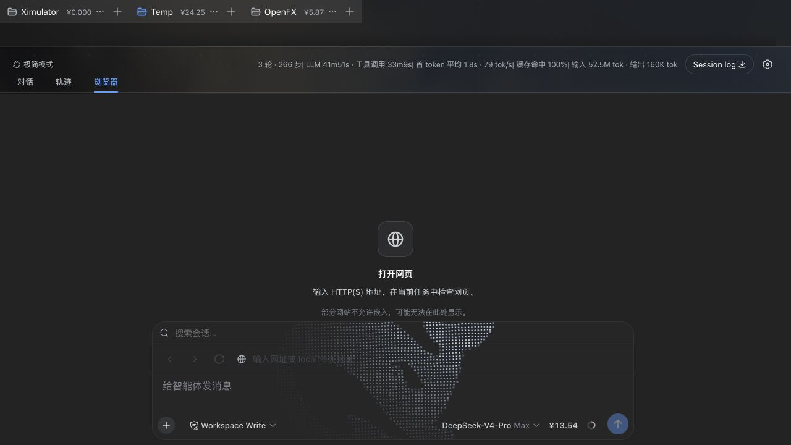
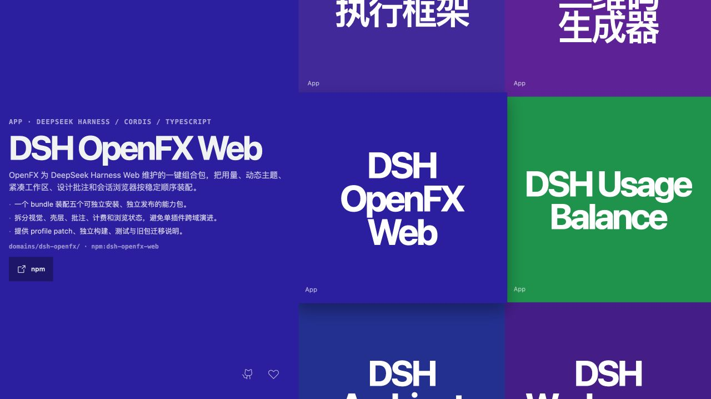

# DSH OpenFX Web

DSH OpenFX Web 是 OpenFX 为 DeepSeek Harness Web 维护的一组可组合插件。旧的 `dsh-harness-background` 同时承担背景、导航重排和设计批注，难以独立演进；本目录将其拆成三个单一职责包，并把余额插件与会话浏览器一起纳入一个可选组合包。



## 包结构

| npm 包 | 职责 | 可单独安装 |
| --- | --- | --- |
| `dsh-openfx-web` | 一次安装下面五项能力的组合包 | 是 |
| `dsh-ambient-theme` | 流体极光、粒子网格和鲸鱼点云背景 | 是 |
| `dsh-workspace-shell` | 双行工作区/会话标签、输入区搜索和移动端布局 | 是 |
| `dsh-design-annotations` | `/design` DOM 圈选、批注持久化和会话发送 | 是 |
| `dsh-usage-balance` | 账户余额、会话成本和工作区 token 热力图 | 是 |
| `dsh-conversation-browser` | “轨迹”右侧的沙箱浏览器视图 | 是 |

`dsh-workspace-shell` 只通过 `data-usage-balance-*` 属性读取余额包的可选展示数据；没有安装余额包时，导航和输入区布局仍然工作。`dsh-openfx-web` 只负责组合，不复制各能力包的实现。

六个包也作为 OpenFX 文件库的默认摘要 App 展示：



## 安装

完整套件：

```sh
dsh plugin --profile web add dsh-openfx-web
```

只安装一项能力：

```sh
dsh plugin --profile web add dsh-conversation-browser
```

安装或升级后重启 `dsh web`。会话浏览器通过官方 `conversation.input.dock` 槽把地址栏放在消息输入框上方，和浏览器视图共享会话级状态；不需要修改 DeepSeek Harness 源码或查询宿主 DOM。

## 本地开发

```sh
pnpm install
pnpm build
pnpm test
pnpm typecheck
```

每个包都拥有独立的 `cordis.patch.yml` 和发布清单。`dsh-openfx-web` 的 patch 按余额、主题、壳层、批注、浏览器的顺序挂载五个包。

## 旧包迁移

| 旧包 | 新包 |
| --- | --- |
| `dsh-harness-background` | `dsh-ambient-theme` + `dsh-workspace-shell` + `dsh-design-annotations` |
| `dsh-balance-sidebar` | `dsh-usage-balance` |
| DSH 仓库内置 `ui-browser` 实验包 | `dsh-conversation-browser` |

旧包名不保留兼容入口；安装新包后应从 profile 中删除旧依赖和旧 bundle 行。
