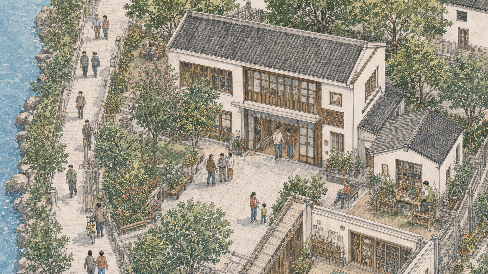

# Phase 11：社区服务中心高精分区试点

## 视觉伴随稿

这张图是圣灯社区三级语义缩放的首个分区资产。它以现有 `community-map-detail-v1`
的服务中心建筑、河岸、前院和邻院关系为构图依据，继续使用淡彩水墨线稿、
低饱和纸张和生活化小人物，不是现实照片、建筑测绘或实景复原。

### 视觉命题

在不改变全景气质的前提下，让用户进入服务中心时看见更细的瓦片、窗格、花木、座椅和邻里活动，
感觉是走近同一张手绘地图，而不是打开另一张海报。

### 内容计划

- 主体：两层社区服务建筑与入口前院。
- 环境：左侧河岸步道、连续树木花坛、右侧邻院和开放式活动空间。
- 生活活动：居民咨询、社区工作人员交谈、步行与自行车。
- 产品内容：常驻“社区服务中心”标签和既有三个服务入口；图片内部不写 UI 文案。

### 交互命题

- 永昌镇全景放大后进入圣灯高精层；点击服务中心建筑或标签后再进入本分区。
- 父级高精图保留在下方，本分区在镜头移动后柔和显现，避免矩形硬切。
- 分区相机严格限制在有效画面内；滚轮向下或减号键返回圣灯高精层。

## 资产与几何

| 层级         | 资产                              | 原始尺寸   | 加载方式               |
| ------------ | --------------------------------- | ---------- | ---------------------- |
| 永昌镇全景   | `community-map`                   | 1606 × 979 | 首屏                   |
| 圣灯高精层   | `community-map-detail-v1`         | 1672 × 941 | 首屏资源               |
| 服务中心分区 | `community-map-service-center-v1` | 1672 × 941 | 点击服务中心后按需加载 |

服务中心分区以圣灯高精层为父坐标，位于父图左上约 `x=10%`、`y=2.5%`，宽度约为父图
`57%`；高度由原始宽高比计算。几何、像素密度和桌面/竖屏覆盖倍率由
`source/community-art-model.js` 统一管理。

## 图像生成辅助记录

本资产使用内置图像生成工具，以 `community-map-detail-v1.png`
作为风格和空间关系参考；生成结果只承担
分区插画素材，最终分层、镜头、交互和内容均由页面代码实现。最终提示词如下：

> Use case: stylized-concept. Asset type: HLC Phase 11 high-detail LOD
> illustration for the community service center district. Image 1 is the
> established visual and spatial reference. Redraw the large two-story white
> community service building in the upper center-left of Image 1, together with
> its paved forecourt, riverside footpath on the left, trees and flowerbeds, and
> the small neighboring courtyard building on the right. Create a substantially
> higher-detail close view of that exact district for seamless semantic zoom in
> an interactive community map. Use delicate Chinese urban-sketch ink linework
> with restrained watercolor wash on warm paper; muted jade green, warm gray
> roof tile, off-white plaster, light river blue and small terracotta accents;
> match Image 1's hand-drawn density and imperfect paper texture. Keep the same
> elevated oblique/isometric viewing angle and light direction. Preserve the
> river-left, building-center and courtyard-right relationship. No embedded
> interface, labels, pins, numbers, readable text, logos, watermark,
> photographs, photorealism, satellite view or generic 3D rendering.

## 验收标准

- 全景、圣灯高精层和服务中心分区之间没有可见空白或矩形接缝。
- 服务中心分区在桌面和手机竖屏均不超过原始像素密度上限。
- 只有服务中心标签在本分区保持可见和可点击，其余六个场所仍属于父级高精层。
- 未进入服务中心时不请求分区 PNG/WebP。
- 发布资源中不包含现实照片或写实视频。
