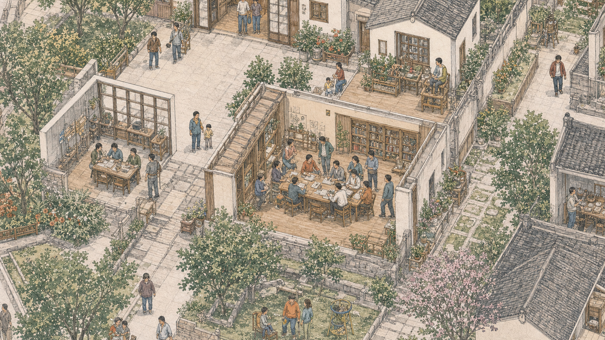

# Phase 12：七场所高精艺术层

## 结果

Phase 11
的社区服务中心试点已经扩展到圣灯高精图中的全部七个场所。新增六张伴随稿不是独立海报，
而是同一张手绘地图在语义放大后的局部艺术层：保留斜俯视、水墨线稿、克制水彩、暖纸纹理和生活化
人物，提升建筑内部、院落设施和服务活动的局部密度。

## 资产与空间定位

所有场所资产均为 1672 × 941，PNG 用作版本化原稿，WebP
用作浏览器按需加载资源。位置为相对 `community-map-detail-v1`
的父级归一化矩形；高度按相同宽高比自动计算。

| 场所         | 资产名                                  | 父级位置 `(x, y, width)` | 画面主体                         |
| ------------ | --------------------------------------- | ------------------------ | -------------------------------- |
| 社区服务中心 | `community-map-service-center-v1`       | `(0.100, 0.025, 0.570)`  | 河岸、前院、两层服务建筑         |
| 民意广场     | `community-map-public-square-v1`        | `(0.214, 0.272, 0.520)`  | 屋顶打开的议事院落、长桌和花园   |
| 初心学堂     | `community-map-learning-room-v1`        | `(0.089, 0.264, 0.420)`  | 开放式课堂、书桌、花床和巷道     |
| 共享工具屋   | `community-map-tool-house-v1`           | `(0.530, 0.360, 0.470)`  | 修理台、手工具、收纳架和白墙小屋 |
| 红茶小院     | `community-map-tea-courtyard-v1`        | `(0.330, 0.425, 0.500)`  | 粉花树、茶桌、石栏和种植床       |
| 技能工坊     | `community-map-skills-workshop-v1`      | `(0.466, 0.063, 0.480)`  | 开放木作空间、培训桌和手工材料   |
| 河畔志愿点   | `community-map-riverside-volunteers-v1` | `(0.155, 0.517, 0.460)`  | 河岸平台、橙色志愿者和清洁工具   |

## 统一交互模型

- 永昌镇全景放大进入圣灯高精层；点击任一建筑或常驻标签进入对应场所艺术层。
- 父级高精图始终在下方承接过渡，当前场所层柔和显现，避免清晰矩形突然覆盖模糊底图。
- 镜头限制在当前资产有效矩形内，不会因拖拽暴露空白；缩小返回圣灯层，再缩小回到全景。
- 场景视口禁用焦点触发的内部滚动，并在每次相机更新时归零滚动偏移；靠近南侧边缘的场所也不会
  因按钮获得焦点而露出父级模糊底图。
- 七个场所分别延迟加载。进入场所层时只保留当前场所标签，场所一览仍提供触屏、键盘和读屏入口。
- 图片内部不包含 UI、标签、序号、定位针、可读文字或现实照片；产品文字继续由 HTML
  提供。

## 图像生成辅助记录

本阶段使用内置图像生成工具，并以 `community-map-detail-v1.png`
作为唯一视觉和空间参考。图像生成
只辅助产出版本化手绘素材；位置模型、加载策略、镜头、交互、标签和内容全部由页面代码实现。

六次生成共用以下最终约束：

> Use case: stylized-concept. Asset type: HLC Phase 12 high-detail place LOD
> illustration. Image 1 is the established visual and spatial reference. Use
> delicate Chinese urban-sketch ink linework with restrained watercolor wash on
> warm paper; muted jade green, warm gray roof tile, off-white plaster, light
> river blue and small terracotta accents; match Image 1's hand-drawn density,
> elevated oblique/isometric angle, light direction and imperfect paper texture.
> Make a landscape close-up with the named place dominant near the visual center
> and continuous street, wall, tree and roof edges. Abstract art only. No UI,
> labels, pins, numbers, readable text, logos, watermark, photographs,
> photorealism, satellite view, generic 3D rendering, fantasy or collage.

各场所追加的主体提示：

- **民意广场**：large roofless open community room, residents around a long
  table, timber floor, low walls, bookshelves and garden; express civic
  discussion.
- **初心学堂**：smaller open classroom in the middle-left, tall dark window
  frames, study table, paved lane and flowerbeds.
- **共享工具屋**：middle-right compact white tile-roof rooms, open-front
  worktable, organized hand tools, baskets, shelves and repair bench.
- **红茶小院**：lower-middle courtyard beneath a pink flowering tree, small
  white house, stone balustrade, planted beds, tea table and kettle.
- **技能工坊**：upper-right open timber workshop, handcraft, fabric and wood
  training tools, instructor and multiple work tables.
- **河畔志愿点**：lower-left riverside lawn and platform, orange vests, litter
  pickers, gloves, sacks, bicycle, railing and bridge path.

## 验收标准

- 七个场所都能从对应建筑或标签进入正确的高精艺术层，详情内容与 URL
  深链接仍对应同一场所。
- 每个分区在桌面和手机竖屏都受原始像素密度上限与有效矩形约束，不露白、不无限放大。
- 切换到任一场所时只加载该场所资源，其他未访问场所仍保持延迟加载。
- 全景、圣灯高精层和场所层之间没有生硬矩形接缝；返回层级一致。
- 发布资源不包含现实照片、写实视频、地图截图或未经艺术化处理的现场素材。
