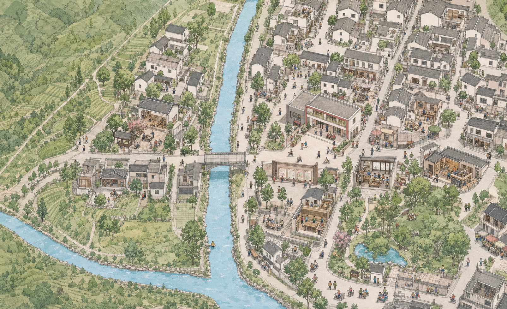

# HLC 真实地理互动社区改造 PRD

> 状态：Phase 14 已完成七场所 15 项服务的统一内容体验\
> 日期：2026-08-02\
> 视觉参照：[Namma Bangalore](https://www.liquidink.design/namma-bangalore/)\
> 适用范围：`domains/hlc` 前台体验；保留现有 CMS、接口和内容页面

这张图只用于验证整体构图、视觉密度和交互分区。它以用户提供的地图截图为地理布局参考，
不是测绘成果，也不代表真实建筑外观、行政边界或最终地名。Phase 6
把它恢复为正式全景基准，但不得把它作为所有缩放级别的唯一图像来源。

## Phase 14 实现状态

- Phase 13
  的社区服务中心试点已扩展到民意广场、初心学堂、共享工具屋、红茶小院、技能工坊和
  河畔志愿点；七个场所共 15 项服务使用同一个内容视图模型。
- 每个场所使用自己的高精手绘伴随稿和强调色，现有留言、会议、组织、工具借用、报名、CMS、
  志愿积分与兑换入口继续工作。
- 控制器以可逆的 `.scene-content-body`
  包装旧页面正文，解决留言输入框、正文与表单的多节点布局； 退出时恢复原
  DOM，不改写旧事件监听。
- 竖屏会按服务数量选择 1、2、3 或 2 × 2
  导航。初心学堂的四服务封面与网格同步增高，正文标题 不会被封面遮挡。
- `abstract-only` 继续隐藏现实照片、写实视频和 CMS
  图片。书记直播间二维码是唯一功能性图像， 以单色纸面方式呈现且不包含实景预览。
- 模型、视觉和验收边界记录在
  [`phase-14-all-place-content.md`](./phase-14-all-place-content.md)。

## Phase 13 实现状态（已由 Phase 14 扩展）

- “走进社区、社区动态、社区示范”共用一个场所内容模型和页面骨架，保留原 CMS
  数据入口， 不复制三套固定页面。
- 服务中心高精艺术层继续承担内容页主视觉；桌面端为场所画面与暖纸正文并置，竖屏端改为上下连续
  阅读，三个服务可原位切换。
- 内容页启用 `abstract-only` 媒体策略：既有现实人物照片、CMS
  动态图片、现场视频和未艺术化素材 不进入前台试点画面。
- 直接打开服务深链接会等待旧内容脚本就绪后恢复正文，避免装饰层与旧页面初始化竞态。
- “返回地图”统一清除服务参数并回到社区服务中心；服务切换使用替换历史记录，保证返回路径稳定。
- 视觉、数据和验收约束记录在
  [`phase-13-service-content-pilot.md`](./phase-13-service-content-pilot.md)。

## Phase 12 实现状态

- 社区服务中心、民意广场、初心学堂、共享工具屋、红茶小院、技能工坊和河畔志愿点均拥有独立的
  1672 × 941 抽象手绘分区资产。
- 七个分区共用 `community-art-model.js`
  的父级坐标、有效矩形、原始像素密度上限和桌面/竖屏
  覆盖倍率；镜头不能拖出当前画面。
- 点击建筑或常驻标签进入对应分区，只保留当前场所标签；缩小统一返回圣灯高精层，再缩小返回
  永昌镇全景。
- 每个场所的 WebP/PNG 都使用 `data-srcset` / `data-src`
  独立按需加载，未进入的分区不会增加 当前页面图片请求。
- 六张新增视觉伴随稿沿用父图斜俯视角、水墨线稿、低饱和水彩和暖纸纹理；没有现实照片、写实
  视频、界面标记、序号圆点或地图截图。
- 资产定位、提示词和验收要求记录在
  [`phase-12-place-art-layers.md`](./phase-12-place-art-layers.md)。

## Phase 11 实现状态（已由 Phase 12 扩展）

- 新增 1672 × 941 的 `community-map-service-center-v1`
  分区伴随稿，以现有圣灯高精图的
  河岸、服务建筑、前院和邻院空间关系为基准，提高瓦片、窗格、花木、人物活动等局部细节密度。
- 运行时从全景、圣灯高精层扩展为三级艺术层。该阶段先让“社区服务中心”的建筑或标签进入
  分区层；Phase 12 已把同一模型扩展到其余六处。
- 分区层拥有独立矩形、原始像素密度上限和桌面/竖屏覆盖倍率；相机不能拖出分区画面，缩小则返回
  圣灯高精层。
- 分区 WebP/PNG 使用 `data-srcset` / `data-src`
  按需加载，用户未点击服务中心时不会请求该资源。
- 页面内的视觉伴随稿、空间映射和交互实现是本阶段主体；图像生成只用于辅助产生版本化手绘素材。
  素材没有使用现实照片、写实视频、地图截图或未经艺术化处理的实景内容。
- 资产决策、最终提示词和验收要求记录在
  [`phase-11-service-center-pilot.md`](./phase-11-service-center-pilot.md)。

## Phase 10 实现状态

- 总览中的“圣灯片区 / 7 个场所”聚焦按钮已从页面结构、控制器和样式中删除。
- 总览镜头在覆盖视口的基础上额外放大约 6%，默认构图更饱满。
- 总览和高精镜头分别限制在各自艺术图层的实际矩形内；拖拽到任一边缘时，视口仍由对应画面覆盖，
  不会露出世界画布的空白区域。
- 滚轮、加号键或等价缩放操作继续负责从永昌镇总览进入圣灯高精层。

## Phase 9 实现状态（继续生效）

- 高精画面中的七个场所名称默认常驻显示，标签直接覆盖在对应建筑、开放式房屋或实体木平台上。
- 建筑不再响应悬停执行抠图、放大、提亮、投影或入场脉冲；点击后只执行镜头聚焦和详情面板流程。
- 右侧地图控制按钮组已从页面结构中删除；拖动、滚轮、方向键、加减号和 Home
  键操作继续保留。
- 标签与建筑点击范围由 `community-map-model.js`
  的结构化配置管理；场所列表继续作为触屏、键盘和读屏的等价入口。

## Phase 8 实现状态（已被 Phase 9 替代）

- 高精画面不再绘制序号圆点、多边形染色或描边；七个入口从同一张高精原画中实时复制对应
  建筑、开放式房屋或实体木平台的像素，并以精细遮罩完成抠图。
- 常态下抠图与原画完全重合且不可见；悬停、键盘聚焦或选中后，抠图整体抬升约
  7.5%、提亮并 产生纸面投影，名称随建筑出现，形成“建筑从画里浮起来”的反馈。
- 抠图轮廓、标签锚点和镜头焦点由 `community-map-model.js`
  的结构化配置管理，点击区域跟随抠图轮廓；真实 WGS84
  坐标继续承担全景定位和范围校准。
- 建筑入口仍是语义化 HTML
  按钮；移动端可直接轻触，场所列表继续作为键盘、读屏和快速查找的等价入口。

## Phase 7 实现状态（已被 Phase 9 替代）

- Phase 7
  曾把序号圆点替换为不规则可点击区域和轮廓染色；该方案仍然是覆盖层，且不能可靠贴合
  原画建筑，因此没有作为当前交互保留。

## Phase 6 实现状态

- 最初的手绘位图继续决定全景构图、色彩、密度和空间气质，不采用 Phase 4/5
  的程序化矢量效果作为正式视觉基准。
- 地图使用语义缩放：永昌镇全景显示
  `community-map`，进入用户圈定的圣灯范围后切换到 独立绘制的
  `community-map-detail-v1`，而不是继续放大同一张全景图。
- 高精镜头按视口和素材原始像素上限共同计算，缩小则直接返回覆盖视口的全景层。两层仍使用同一
  WGS84 相机、热点和范围坐标，因此业务交互与真实地理数据没有丢失。
- 高精图只采用手绘概念图、公开地图方位和产品范围作为参考；没有把现实照片或写实视频纳入产品。
- 被否决的三套视觉伴随稿已删除，不再保留 URL 开关或运行时代码。

## Phase 5 实现状态

- 用户在前台圈定的四节点范围已固化为
  `source/data/shengdeng-focus.geojson`，并作为没有本机覆盖版本时的项目默认范围。其东西跨度约
  372 m、南北跨度约 427 m；该数据仍明确标记为 `product-focus-area` 和
  `administrativeBoundary: false`。
- 初版范围内生成 28 组确定性的抽象建筑与院落。资产方向参考附近公开道路几何，完整
  footprint 必须落在 polygon 内；范围外不生成同级资产。
- 全景和老城区层级只显示“圣灯片区”聚合入口，避免七个热点在 5 km
  级视图中堆叠。进入片区后， 最大缩放提高到 9.5 倍并展开 detail
  LOD、建筑细部和七个内容场所。
- 七个内容场所按照结构化相对位置重新编排在初版范围中。它们表达服务内容，不声称是经过测绘的
  实体 POI；后续拿到准确设施位置时，可替换为审定坐标。
- 桌面和手机使用同一 polygon
  与资产模型；热点大小抵消地图缩放，手机聚焦倍率更高，保持触控
  目标与街区可读性。
- Phase 5 使用 SVG、DOM/CSS 和纯二维投影，没有引入
  Three.js，也没有加载现实照片；该程序化艺术层在 Phase 6
  中已退出正式前台主视觉。

这一阶段解决的是“在哪里加载高精内容、以什么密度出现、如何进入和浏览”。下一步需要把程序化
屋顶和院落逐步替换为基于社区文字记录、草图和审校意见创作的抽象分层资产，而不是把现场照片直接
放进产品。

## Phase 4 实现状态

- Phase 4 曾把运行时地图由单张概念位图替换为 WGS84
  矢量世界。场景范围覆盖圣灯社区中心周边约 2.6 km
  的永昌镇老城区语境，离线快照记录 156 条道路、水系与地景要素、抓取日期、来源和
  ODbL 许可信息。
- 世界坐标、镜头平移/缩放、视口反投影、context/town/detail 三档 LOD、640 m
  分块裁剪和热点坐标使用同一套纯函数模型；拖拽到原始数据边缘之外时仍由程序化纸张地景承接，
  不出现位图露白。
- SVG
  渲染层保留真实水系与道路相对关系，并以暖纸、墨线、低饱和色块和程序化城市肌理做抽象
  表达。当前公开数据没有足够的老城区建筑轮廓，因此没有伪造“真实建筑”；建筑与人物高精资产留到
  社区范围和内容审校完成后制作。
- “圈定圣灯范围”工具支持地图落点、撤销、清除、保存本机版本和导出
  `shengdeng-focus.geojson`。输出明确标记为
  `product-focus-area`、WGS84、非行政边界， 并带绘制者、时间、用途和递增版本号。
- 桌面、手机和超宽屏复用同一场景。热点视觉尺寸会抵消世界缩放；手机总览隐藏拥挤文字，但保留
  语义按钮和“场所一览”替代入口。
- Phase 4 没有使用 Three.js，也没有加载现实照片或写实视频。Phase 6
  已根据用户确认恢复 PNG/WebP 全景，并通过独立高精层解决连续放大模糊问题。

下一阶段不是继续扩大底图，而是由社区人员在本工具中人工校核圣灯展示范围、场所坐标和地名，
然后只在该范围内制作高精度抽象建筑、人物活动与服务场景；范围外的永昌镇保持低/中精度背景。

## 2026-08-02 架构与素材约束

- 正式场景覆盖永昌镇老城区的低/中精度地理骨架；圣灯社区高精度范围由人工在地图上圈定，
  保存为带版本和用途说明的 GeoJSON，不冒充行政边界。
- 场景按全景艺术层、道路/水系几何、圣灯社区高精艺术层、人物活动和 HTML
  交互层分层，并使用分级资产与
  LOD，避免单张位图放大模糊、缩小或拖拽后露出空白边缘。
- Phase 4 默认使用 SVG、Canvas 2D、DOM/CSS 等二维/2.5D 技术，不引入 Three.js。
  只有在后续出现已验证且二维方案无法解决的立体渲染需求时，才重新评审
  WebGL/Three.js。
- 最终产品和发布素材包不得包含或直接展示现实照片、写实视频或未经艺术化处理的实景图。
  所有可见地图、建筑、人物、活动和内容配图都必须是矢量插画、手绘分层资产、程序化纹理
  或其他经过抽象艺术化处理的产物。
- 现场资料如用于内部校核，只能作为不随产品发布的参考；前台、PWA 缓存、静态资源和
  CMS 展示内容均不得回退到原始照片。

## Phase 3 实现状态

- 场景模型记录 WGS84 中心点 `31.6450428, 104.4166911`，数据源为 OpenStreetMap
  `node 5222769424`，并在前台提供“地图依据”说明。
- 在概念图中标注西河片区、安昌河水系、安州大道西段、永昌镇街巷和安昌人民公园方向，明确区分
  公开地理信息、用户地图校核和概念表达。
- 点击场所后镜头会自动把热点移到内容面板之外；移动端使用更靠上的取景点，为底部服务抽屉留出
  可视空间。
- 场所与服务使用 `#place=...&service=...`
  深链接，可刷新、分享并通过浏览器历史返回场所上下文。
- 服务页退出后恢复对应场所详情和地图位置，不再丢失探索路径。
- Phase 3 曾优先加载约 581 KB 的 WebP 场景图；Phase 4 一度停止加载，Phase 6
  已将它恢复为全景视觉基准，并增加独立高精图层。

Phase 3
完成的是可验证的交互和美术方向原型，不是可扩展地图架构或建筑测绘。正式建筑、道路细节和
社区展示范围仍需社区提供范围确认、地名审校、设施位置和文字描述后才能定稿。

## Phase 2 实现状态

- 七个地图场所已经从单一入口扩展为具体服务分支，并直接复用现有 HLC 栏目与接口。
- 场景增加水流光带、薄雾漂移和指针景深；系统开启“减少动态效果”时保持静态。
- 旧版栏目菜单、文章、留言、组织、表单与二维码页统一为暖纸、墨色和圆角面板语言。
- 从地图进入内容页时保留场景作为背景，内容页退出会直接回到原地图位置。
- 空文章列表提供明确空状态；桌面和移动端共用同一场景模型与服务路由。

当前场景仍是用于验证地理骨架与体验方向的概念插画。进入正式插画定稿前，仍需社区确认展示
范围、服务中心位置、地名、设施用途与艺术化表达方向。

## Problem Statement

HLC 当前以一张摄影封面和三组层级菜单组织“社区风采、群众发言吧、四心治理”等内容。
信息虽然完整，但入口之间缺少空间关系，社区生活也主要表现为抽象栏目，不能让居民快速形成
“这是我生活的圣灯社区”的直觉。

改造目标是把前台升级为一张可漫游、可探索的圣灯社区手绘地图：先用真实水系、道路、山地、
街区和公共空间建立地方认同，再把现有内容映射为社区中的可点击场所。视觉语言借鉴目标页面的
等距手绘城市、拖拽漫游和场景内故事卡，但不复制其建筑、插画、文案或交互素材。

成功标准：

- 熟悉当地的用户能从水系、桥路、山地和街区关系辨认出圣灯社区所在区域。
- 用户无需理解现有栏目树，也能从“去哪里、做什么”的场所语义进入内容。
- 桌面端和移动端共享同一张场景与内容模型，不以“请使用电脑”作为移动端降级方案。
- 现有 CMS、内容接口和治理栏目在首期继续工作，视觉改造不扩大为后端重写。
- 最终前台不展示现实照片或写实视频；历史内容中的照片必须隐藏或替换为经审定的艺术化衍生资产。

## 真实地理基线

### 已确认事实

- 项目指向四川省绵阳市北川羌族自治县永昌镇圣灯社区，行政区划代码为
  `510726103008`。
- 永昌镇政府公开地址位于圣灯社区大东街 13
  号，可作为场景中社区公共服务核心的地理锚点，
  但不等同于圣灯社区居委会的精确位置。
- OpenStreetMap 的“圣灯社区”节点约为 `31.6450428, 104.4166911`（WGS84），可用于
  初始取景，不可单独推导行政边界。
- 用户提供的地图截图清晰呈现了西侧山地/低密片区、中央南北向水系、西南汇流、横向桥路、
  东侧密集街区以及东南公园水面的空间关系。这些关系是首版场景的硬约束。

### 证据与来源

- [四川省人民政府行政区划调整批复（PDF）](https://www.sc.gov.cn/10462/zfxxgkzn/2019-07/06/bf9bb40a2056415b8b75e1f4ba6ee417/files/4a17a2fa5abc4f19bbfd8353e976e77d.pdf)
- [北川羌族自治县 2023 年行政区划代码](https://xzqh.org/show/china/2023/51/510726.html)
- [OpenStreetMap：圣灯社区节点](https://www.openstreetmap.org/node/5222769424)
- [北川三元投资：安昌河综合治理项目](https://www.bcsanyuan.com/nd.jsp?groupId=13&id=521)
- [圣灯社区城乡结合部治理报道](https://sc.sina.cn/news/m/2022-11-04/detail-imqqsmrp4867453.d.html)
- [圣灯社区西河片区公开报道](https://www.sohu.com/a/556850410_121123873)

### 尚未确认的边界

- 截图展示的是圣灯社区及其周边环境，不代表精确的社区行政边界。
- 场景中的水系暂用“中央水系”“西南支流”等工作名；在获得权威河道数据前，不把推测名称
  绘入正式地图。
- 概念图中的建筑、广场、桥和设施是内容场景，不声称对应真实建筑外观。
- 若底图或测绘数据来自高德/腾讯地图，需要先处理 GCJ-02；OSM 与公开经纬度通常使用
  WGS84。两套坐标不可直接混用。

## Solution

### 体验概念

用户进入网站后，先看到一句简短欢迎语和圣灯社区轮廓；进入后是一张 16:9
的等距手绘社区。
用户可以拖拽地图、滚轮或按钮缩放，并点击带有生活动作的场所，而不是点击传统导航图标。
选中场所后，地图轻微聚焦，侧边或底部打开内容卡，关闭后回到原位置。

首屏不追求还原每一栋建筑，而要做到“骨架真实、场景可信、内容可识别”：

1. 西侧山地与低密生活区形成绿色背景和安静节奏。
2. 中央水系贯穿画面，西南支流在底部汇入，成为最强地理识别符。
3. 一条横向桥路连接东西两岸，也是视觉与交互的中轴。
4. 东侧老镇街巷更密集，容纳服务、商业、议事和学习场景。
5. 东南公园与水面提供休憩空间，并承接志愿服务和居民活动。

### 场景分区

| 分区              | 地理依据                               | 画面语言                               | 内容职责                             |
| ----------------- | -------------------------------------- | -------------------------------------- | ------------------------------------ |
| 西侧山地/低密片区 | 截图西侧大面积绿地及公开“西河片区”语境 | 山坡、菜地、步道、院落，低饱和鼠尾草绿 | 社区故事、邻里互助、生态与生活影像   |
| 中央水系          | 截图中偏西的南北水道及西南汇流         | 浅蓝水面、石岸、河边步道、志愿者       | 地理主轴、导览线、环境治理内容       |
| 横向桥路          | 截图中部东西向道路跨河                 | 桥、人行流线、骑行和公共交通细节       | 两岸转换、通知与活动导流             |
| 东侧老镇街区      | 截图东侧高密度道路和建筑               | 灰瓦白墙、小店、院坝和生活人物         | 社区治理、居民发言、学习与服务主场景 |
| 东南公园/水面     | 截图东南公共绿地及小型水面             | 林荫、亭廊、小池、长椅和活动人群       | 志愿活动、休闲服务、适老与儿童内容   |

### 内容场所映射

| 场所热点                | 现有内容入口                                   | 场景动作与识别物                       |
| ----------------------- | ---------------------------------------------- | -------------------------------------- |
| 社区服务中心            | 社区架构、社区动态、圣灯示范                   | 办事、咨询、公告橱窗；作为场景视觉焦点 |
| 公共广场 / 民意墙       | 群众发言吧                                     | 居民张贴、讨论、查看处理进度           |
| 初心学堂                | 以学促行守初心：直播间、会议室、学习吧、自管委 | 阅读、开会、直播与议事                 |
| 温情服务站 / 共享工具屋 | 温情治理暖人心：参与治理、工具房、集米活动     | 借用工具、登记服务、邻里互助           |
| 红茶小院                | “一杯红茶”相关社区故事                         | 围坐喝茶、倾听与关怀                   |
| 技能工坊                | 以技育人提信心、技能报名                       | 木作/手作、培训与报名                  |
| 河畔志愿点              | 环境治理、志愿行动和活动图库                   | 巡河、清洁、照护绿地                   |
| 商铺与街巷              | 社区风采、图集、人物故事                       | 日常经营、散步、邻里交往               |
| 信息按钮                | HLC / 圣灯社区介绍                             | 独立模态窗，不占用地理热点             |

热点必须通过人物活动、建筑用途和微动画被看见，同时保留文本标签、聚焦样式和语义按钮，
不能只依赖颜色或“猜哪里能点”。

## User Stories

### 居民与访客

- 作为第一次访问的人，我希望在进入地图前看到社区名称和一句清晰说明，以便理解这是圣灯社区
  的互动导览，而不是导航软件。
- 作为熟悉当地的居民，我希望看到水系、桥路、山地和街区的正确相对位置，以便产生真实感。
- 作为居民，我希望拖拽地图探索不同区域，并能随时一键回到社区服务中心。
- 作为居民，我希望点击民意墙后直接留言或查看已有回应，不必先理解“群众发言吧”的菜单层级。
- 作为居民，我希望在共享工具屋查看可借物资和借用方式。
- 作为居民，我希望在初心学堂进入直播、会议、学习和自管委内容。
- 作为求职或学习技能的居民，我希望从技能工坊查看介绍并进入报名流程。
- 作为访客，我希望通过街巷、人物和图库了解社区日常，而不是只看到机构介绍。
- 作为老年用户，我希望热点文字足够大、对比清晰、点击区域宽松，并且不依赖快速动画。
- 作为移动端用户，我希望用单指拖动画面、双指缩放，并用底部卡片阅读内容。
- 作为低性能设备用户，我希望先看到可操作的低清场景，再逐步加载人物和微动画。
- 作为容易晕动的用户，我希望系统尊重“减少动态效果”设置，关闭自动平移和循环动画。

### 键盘和辅助技术用户

- 作为键盘用户，我希望按 Tab 依次聚焦热点，用 Enter 打开，用 Escape 关闭详情。
- 作为屏幕阅读器用户，我希望每个热点都有场所名称、用途和当前状态，而不是读到无意义坐标。
- 作为低视力用户，我希望放大页面后内容卡仍可阅读，地图也不会遮挡主要操作。

### 内容运营人员

- 作为社区编辑，我希望继续使用现有 CMS
  更新文章、图库、人员和物资，不必在首期学习新后台。
- 作为编辑，我希望一个现有内容条目能被配置到某个场所，而不是把文案写死在插画或前端代码里。
- 作为编辑，我希望热点下线时内容仍能通过可访问的列表入口找到。
- 作为维护者，我希望热点位置、标签、内容映射和镜头参数由结构化配置管理，方便后续更换插画。

## Implementation Decisions

### 数据与架构

- 首期保留现有 Deno 服务、KV、CMS 和内容 API；前台改造通过适配层消费旧数据。
- 建立唯一的
  `scene model`，包含区域、热点、内容引用、镜头位置、无障碍文本和资产状态。
  桌面端与移动端只改变呈现，不复制两套业务数据。
- 场景资产至少分为基础地理层、建筑/植被层、人物活动层、前景遮挡层和可选动画层。
  地理对齐仍以矢量几何为规范源；人物与微动画延迟加载。位图可以承担一个固定语义层级，
  但不能作为跨越所有缩放级别、被无限放大的唯一资源。
- 热点使用真实 HTML button
  或等价语义控件覆盖在场景坐标上；插画本身不承担可访问性和业务状态。
- 内容详情采用统一的
  `detail panel`：桌面端右侧卡片，移动端底部抽屉；面板负责滚动，地图保持位置。
- 导航控制器负责拖拽、缩放、聚焦、恢复镜头和 URL
  状态。返回/前进应能还原打开的场所。
- 不把整张插画做成一个充满硬编码 ID 和业务逻辑的单体
  SVG。美术资产与内容配置解耦。
- 记录每个地理数据源、坐标系、抓取日期和许可。WGS84 与 GCJ-02
  通过显式转换适配，不在视觉层 手工“对齐”。

### 视觉系统

- 主色为暖白、墨黑、鼠尾草绿、浅水蓝和沙色；珊瑚红/粉色仅用于人物动作、重点入口和状态反馈。
- 线稿保持手绘感，但道路、水岸和热点建筑轮廓要比装饰物更清楚。
- 场景人物以真实社区活动为主，避免乐园化、赛博化或脱离当地生活的奇观元素。
- 微动画限定在水面、树叶、人物小动作和热点反馈；不让整张地图持续晃动。
- 中文为主要界面语言；场景内文字尽量通过 HTML 叠层呈现，避免把小字烘焙进位图。
- 不使用现实照片、写实视频或照片式全景作为最终视觉内容。现实地理负责结构真实性，艺术化资产
  负责视觉呈现，两者通过结构化坐标和素材清单关联。

### 响应式与输入

- 桌面端使用横向主场景，支持鼠标拖拽、触控板平移、滚轮缩放和键盘导航。
- 移动端仍使用同一场景，默认聚焦核心区；用紧凑工具条和底部抽屉减少地图遮挡。
- 提供“场所列表”作为地图的等价入口，方便查找、搜索和辅助技术访问。
- 所有交互都需支持触控，目标尺寸不小于 44×44 CSS 像素。

## Testing Decisions

### 地理与内容验收

- 用用户提供的地图截图逐项核对五个硬锚点：西侧山地、中央水系、西南汇流、横向桥路、东南公园。
- 在拿到社区边界或实景材料前，自动和人工检查页面不得出现“精确边界”“真实复原”等表述。
- 为每个热点建立“场所 → 旧栏目/API → 详情面板”的映射测试，防止改造后内容丢失。
- 邀请至少一名熟悉圣灯社区的审核者进行地理辨识和名称校对。

### 交互与可访问性验收

- 覆盖拖拽、缩放、聚焦、关闭、浏览器返回/前进和恢复镜头。
- 仅用键盘完成进入地图、遍历热点、打开详情、关闭详情和返回核心区。
- 检查屏幕阅读器名称、焦点顺序、焦点可见性、颜色对比和 200% 页面缩放。
- 在 `prefers-reduced-motion: reduce` 下关闭自动镜头运动和非必要动画。
- 分别验证桌面鼠标、触控板、iOS Safari 和 Android 主流浏览器触控行为。

### 性能与回归验收

- 首屏先呈现地理底层和可操作骨架；延迟加载失败时仍可通过场所列表访问全部内容。
- 建立低端移动设备预算，重点观察首屏图片体积、解码时间、交互可用时间和内存。
- 回归验证现有文章、图库、人员、组织、物资、请求和留言接口。
- 验证长文、空内容、图片失败、离线/PWA 恢复和 CMS 未配置热点等异常状态。
- 对静态资源、PWA 预缓存清单和 CMS
  前台输出做素材审计，确保没有现实照片或写实视频进入发布产物。

## Out of Scope

- 在没有权威矢量数据的情况下绘制或发布圣灯社区行政边界。
- 本阶段交付可直接上线的终稿插画、全部人物动画或真实建筑复原。
- 重写 CMS、KV、文件存储、登录体系或处理 README 中列出的 legacy 安全债务。
- 把 HLC 立即迁移为 OpenFX 主 Web 的 React 页面。
- 部署、域名切换、生产数据迁移和运营内容录入。

## Further Notes

### 进入视觉定稿前需要补齐

- 权威社区边界 polygon，或社区明确认可的展示范围。
- 社区居委会/服务中心的准确位置、建筑用途、层数和可识别结构的文字或现场草图说明。
- 桥、水岸、主街、广场、公园及西河片区的方向、结构、材质和生活活动文字记录。
- 社区确认的地名、河名、公共设施名称和对外表述。
- 可合法使用的社区标志、艺术化人物/活动设定与品牌色资料。

### 建议实施顺序

1. 使用前台圈选工具与社区共同确认展示范围，并提交审定后的
   `shengdeng-focus.geojson`。
2. 审核七个热点的真实位置、场所命名、用途和地名，修正结构化坐标配置。
3. 只在审定范围内制作高精抽象建筑、人物活动与服务场景；范围外维持当前低/中精度骨架。
4. 补充键盘、无障碍、低性能设备和真实移动浏览器验收。
5. 完成社区内容审校与发布素材照片审计后再进入上线准备。
